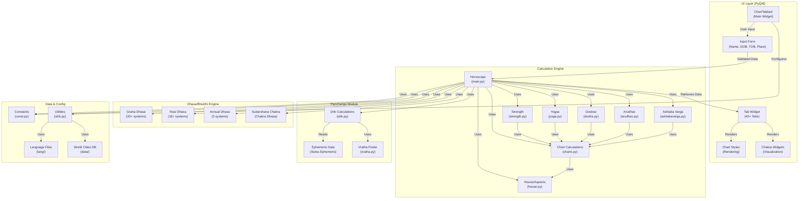
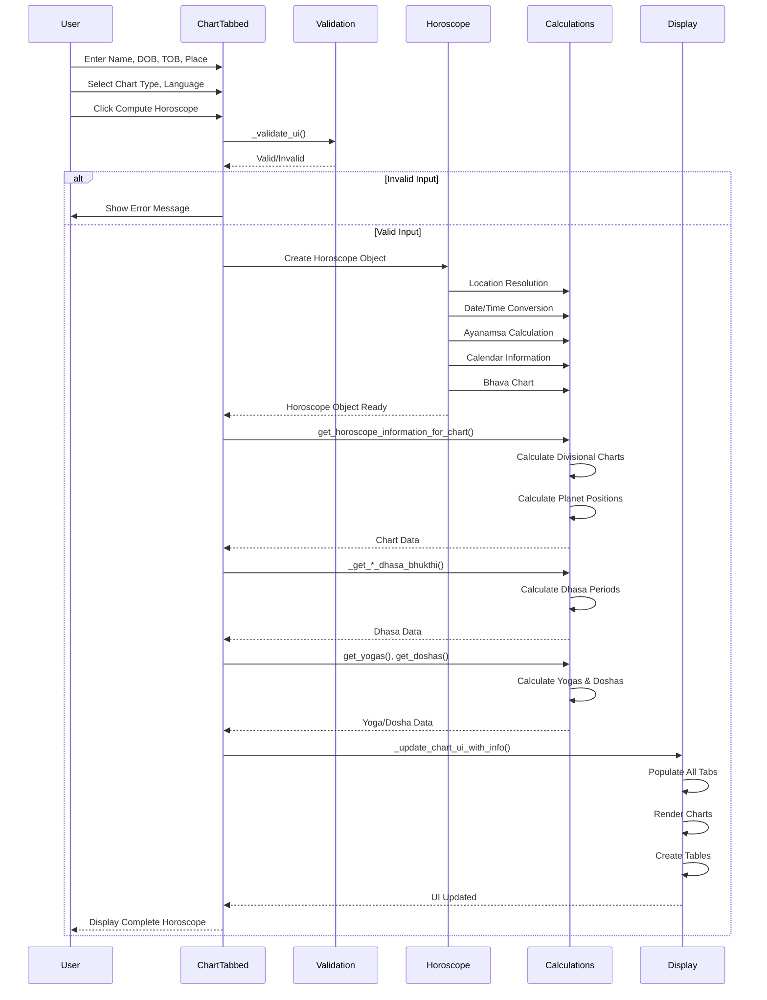
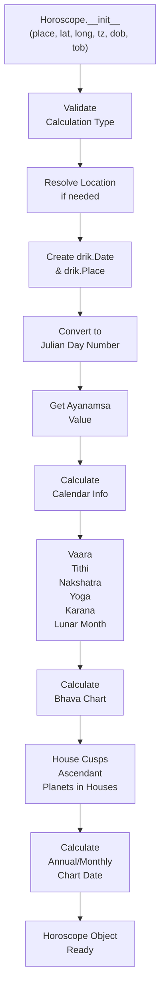
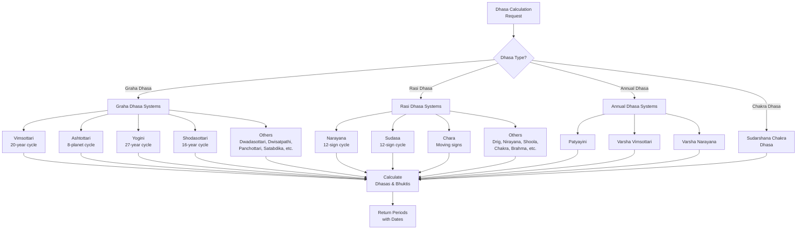
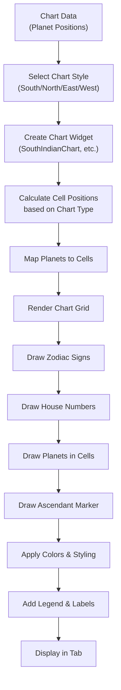
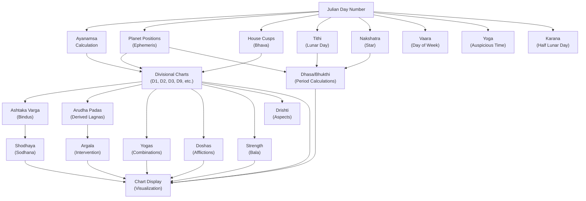
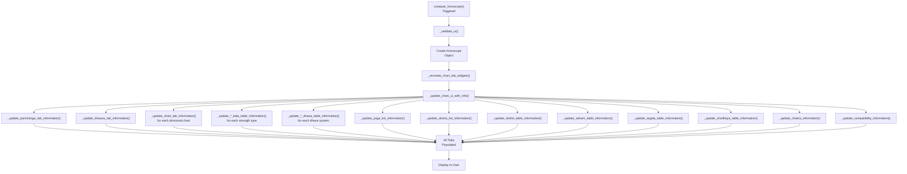
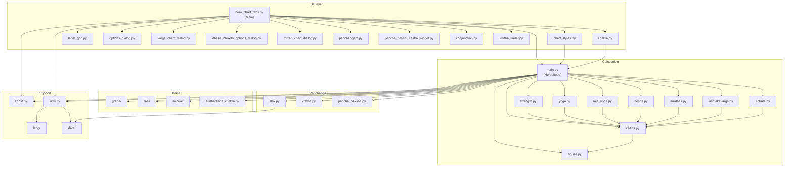

# PyJHora Architecture - Visual Diagrams

## 1. System Component Interaction Diagram

## 2. Data Flow - User Input to Chart Display

## 3. Horoscope Initialization Flow

## 4. Chart Calculation Pipeline

```mermaid
graph LR
    A["Julian Day<br/>Number"] --> B["Divisional<br/>Chart Factor"]
    B --> C["Calculate<br/>Planet Positions"]
    C --> D["Apply<br/>Ayanamsa"]
    D --> E["Determine<br/>Sign & House"]
    E --> F["Check<br/>Retrograde"]
    F --> G["Check<br/>Combustion"]
    G --> H["Chart Data<br/>Dictionary"]
    H --> I["Calculate<br/>Aspects"]
    I --> J["Calculate<br/>Strengths"]
    J --> K["Calculate<br/>Yogas"]
    K --> L["Complete<br/>Chart Info"]
```

## 5. Dhasa Calculation Hierarchy

## 6. Tab Widget Structure

```mermaid
graph TD
    TW["Tab Widget<br/>(40+ Tabs)"]
    
    TW --> T1["Tab 1: Panchangam<br/>(Calendar Info)"]
    TW --> T2["Tab 2: Bhaava<br/>(Houses)"]
    TW --> T3["Tab 3: Pancha Pakshi<br/>(Bird Omens)"]
    TW --> T4["Tabs 4-28: Divisional Charts<br/>(Raasi, Hora, Drekkana, Navamsa, etc.)"]
    TW --> T5["Tabs 29-34: Strength Tables<br/>(Vimsopaka, Vaiseshikamsa, Shad Bala, Bhava Bala, etc.)"]
    TW --> T6["Tabs 35-55: Dhasa/Bhukthi<br/>(Vimsottari, Ashtottari, Yogini, Narayana, Sudasa, etc.)"]
    TW --> T7["Tab 56: Ashtaka Varga<br/>(Bindus & Sodhana)"]
    TW --> T8["Tab 57: Argala<br/>(Intervention)"]
    TW --> T9["Tab 58: Shodhaya<br/>(Ashtaka Varga Sodhana)"]
    TW --> T10["Tab 59: Yogas<br/>(100+ Yogas)"]
    TW --> T10a["Tab 60: Doshas<br/>(Mangal, Nadi, Bhakoot, etc.)"]
    TW --> T11["Tab 61: Chakras<br/>(Kota, Kaala, Sarvatobadra, etc.)"]
    TW --> T12["Tab 62: Compatibility<br/>(Marriage Match)"]
    
    T1 --> T1a["Vaara, Tithi, Nakshatra<br/>Yoga, Karana<br/>Lunar Month, Tamil Calendar<br/>Sunrise/Sunset"]
    T2 --> T2a["House Cusps<br/>Planets in Houses<br/>House Lords<br/>Karakas"]
    T4 --> T4a["Chart Visualization<br/>Planet Positions<br/>Sign Placements<br/>House Positions"]
    T5 --> T5a["Strength Values<br/>Bala Calculations<br/>Comparative Analysis"]
    T6 --> T6a["Dhasa Periods<br/>Bhukthi Periods<br/>Dates & Durations<br/>Current Period Highlight"]
    T7 --> T7a["Argala Planets<br/>Virodhargala<br/>Intervention Analysis"]
    T10 --> T10b["Yoga Names<br/>Yoga Descriptions<br/>Benefic/Malefic Status"]
    T10a --> T10c["Dosha Names<br/>Dosha Descriptions<br/>Severity Levels"]
    T11 --> T11a["Chakra Visualization<br/>Chakra Positions<br/>Chakra Analysis"]
    T12 --> T12a["Compatibility Score<br/>Porutham Matches<br/>Star Compatibility<br/>Detailed Analysis"]
```

## 7. Chart Rendering Pipeline

## 8. Calculation Dependencies

## 9. UI Update Flow

## 10. Module Dependency Graph

